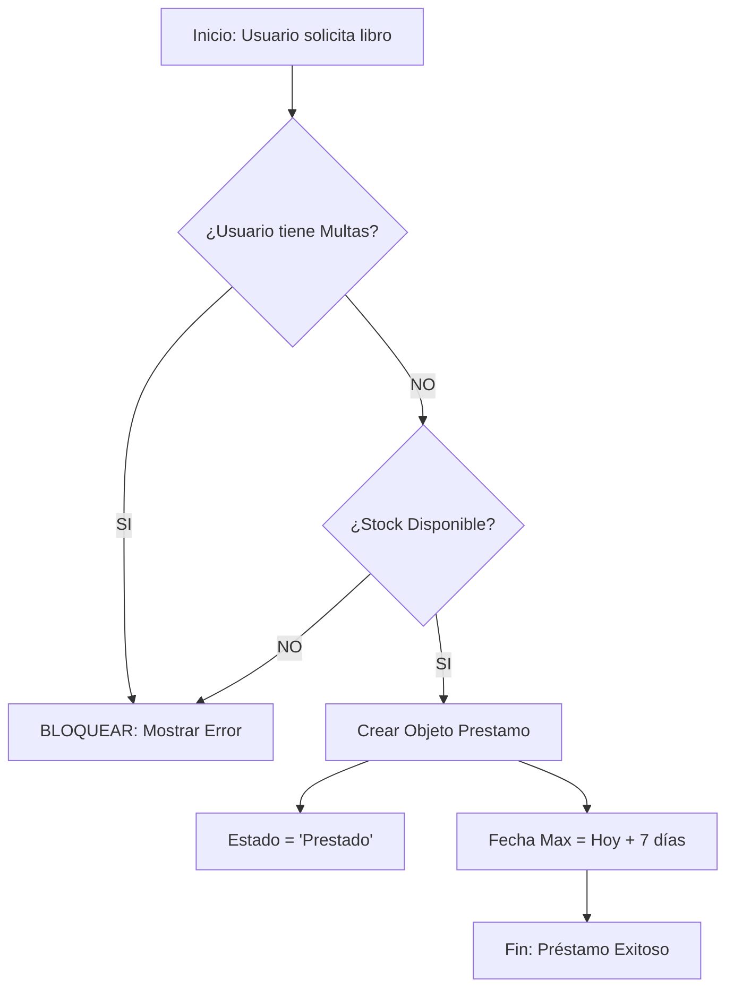

# Documentación Técnica del Sistema de Gestión de Biblioteca (BLB Django)

Este documento detalla la arquitectura, lógica de negocio y flujos críticos del sistema. Está diseñado para desarrolladores que necesitan entender **dónde** está el código, **qué** hace y **cómo** se relacionan las piezas.

---

## 1. Arquitectura de Datos (Modelos)

**Archivo:** `c:\blb_django\gestion\models.py`

Esta es la columna vertebral del sistema. Define cómo se guardan los datos y gran parte de la lógica automática.

### A. Modelo `Prestamos` (El Núcleo del Negocio)
Gestiona el ciclo de vida de un libro prestado.

**Relaciones:**
*   `libro` (ForeignKey -> `Libro`): Un préstamo pertenece a un solo libro.
*   `usuario` (ForeignKey -> `User`): Un préstamo pertenece a un usuario.
*   `Multa` (Reverse Relation): Un préstamo puede tener muchas multas (accedido vía `prestamo.Multa.all()`).

**Lógica Crítica (Línea por Línea):**

```python
# Definición de Estados (Máquina de estados finita simple)
ESTADOS = (
    ('borrador', 'Borrador'),   # Aún no confirmado
    ('prestado', 'Prestado'),   # Libro fuera de la biblioteca (Tiempo corriendo)
    ('devuelto', 'Devuelto'),   # Proceso finalizado correctamente
    ('multado', 'Multado')      # Proceso finalizado o vencido con deuda
)

# Método Crítico: confirmar()
def confirmar(self):
    # Solo actúa si está en borrador
    if self.estado == 'borrador':
        self.estado = 'prestado'           # TRANSICIÓN DE ESTADO
        self.fecha = timezone.now().date() # Setea fecha inicio
        
        # LÓGICA DE NEGOCIO: Si no se define fecha manual, se dan 7 días.
        if not self.fecha_max:
            self.fecha_max = self.fecha + timezone.timedelta(days=7)
        self.save()
```

### B. Modelo `Libro`
Representa el inventario físico.

**Variables Django Clave:**
*   `models.ManyToManyField`: Usado en `categorias`. Permite que un libro tenga muchos géneros y un género muchos libros.
*   `@property`: Decorador de Python usado para crear "campos virtuales" que no se guardan en BD pero se calculan al vuelo.

**Lógica Crítica:**
```python
@property
def disponibles(self):
    # Lógica: Total Stock - (Total Préstamos Activos)
    # Filter: Busca préstamos donde fecha_devolucion NO EXISTE (isnull=True)
    prestados = self.Prestamos.filter(fecha_devolucion__isnull=True).count()
    return self.stock - prestados
```

### C. Modelo `PerfilUsuario` (Extensión)
Extiende el usuario nativo de Django (`auth.User`) para agregar datos de socio.

**Concepto Django (`Signals`):**
Se utiliza una señal `post_save`. Esto significa que "después de guardar" un Usuario en la tabla estándar de Django, **automáticamente** se dispara una función que crea/guarda este Perfil.

---

## 2. Lógica de Control (Vistas)

**Archivo:** `c:\blb_django\gestion\views.py`

Aquí se define quién puede hacer qué y cómo interactúan los usuarios con los datos.

### A. Vista `crear_prestamo` (Validación Estricta)
Esta función es el "portero" de la biblioteca.

**Partes Cruciales:**

```python
# [CRÍTICO] Bloqueo de Morosos
# 1. Obtenemos todos los préstamos históricos del usuario
prestamos_usuario = Prestamos.objects.filter(usuario=usuario)

# 2. Django Filter: Buscamos si existe ALGUNA multa impaga en esos préstamos
tiene_multas = Multa.objects.filter(prestamo__in=prestamos_usuario, pagada=False).exists()

# 3. Verificamos si tiene libros marcados como 'multado' (Vencidos)
tiene_vencidos = prestamos_usuario.filter(estado='multado').exists()

# Si cualquiera de las dos es True, SE BLOQUEA LA ACCIÓN.
if tiene_multas or tiene_vencidos:
     return HttpResponseForbidden(...) 
```

### B. Vista `finalizar_prestamo` (Gestión de Multas)
Maneja el retorno y la creación de multas variadas (Daño vs Retraso).

**Flujo:**
1. Recibe `POST` request.
2. Extrae `tipo_dano` y `monto_dano`.
3. Llama a `prestamo.finalizar()` pasando esos argumentos.
4. El modelo decide si crear 1 multa (solo retraso), 1 multa (solo daño) o 2 multas (ambas).

---

## 3. Automatización (Cron Jobs)

**Archivo:** `c:\blb_django\gestion\management\commands\verificar_vencimientos.py`

Script diseñado para ejecutarse una vez al día automáticamente.

**Clases Django:**
*   `BaseCommand`: Clase padre necesaria para crear comandos de consola (`python manage.py ...`).

**Lógica del Loop:**
```python
# Filtro Crítico: Solo préstamos ACTIVOS ('prestado') y VENCIDOS (fecha_max < hoy)
prestamos_vencidos = Prestamos.objects.filter(estado='prestado', fecha_max__lt=hoy)

for prestamo in prestamos_vencidos:
    # 1. Cambiar estado para bloquear al usuario en el futuro
    prestamo.estado = 'multado'
    prestamo.save()
    
    # 2. Cálculo de multa
    dias = (hoy - prestamo.fecha_max).days
    monto = dias * 0.50
    
    # 3. Notificación (send_mail)
    # ... envía correo ...
```

---

## 4. Diagramas de Flujo del Sistema

### A. Flujo de Creación de Préstamo


### B. Flujo de Devolución (Devolución)
```mermaid
graph TD
    A[Inicio: Devolver Libro] --> B{¿Tiene Daño/Pérdida?}
    
    B -- SI (Input Manual) --> C[Crear Multa Tipo 'Daño']
    B -- NO --> D
    
    D{¿Tiene Retraso?}
    D -- SI (Auto Calc) --> E[Crear Multa Tipo 'Retraso']
    D -- NO --> F
    
    C --> F
    E --> F[Estado = 'Devuelto']
    F --> G[Stock Disponible Aumenta (+1)]
```

### C. Flujo Automático (Cron Job Diario)
```mermaid
graph TD
    A[Cron se ejecuta (00:00 AM)] --> B[Buscar Préstamos donde Fecha_Max < Hoy]
    B --> C{¿Encontró resultados?}
    C -- SI --> D[Iterar cada Préstamo]
    D --> E[Cambiar Estado a 'MULTADO']
    E --> F[Calcular $$ Pendiente]
    F --> G[Enviar Email a Usuario]
    G --> H[Siguiente Préstamo...]
    C -- NO --> I[Fin del Proceso]
```
